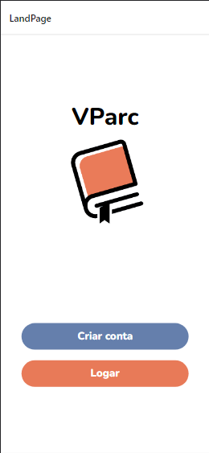
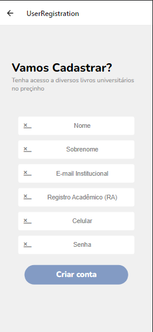
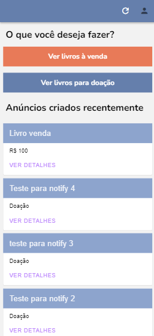
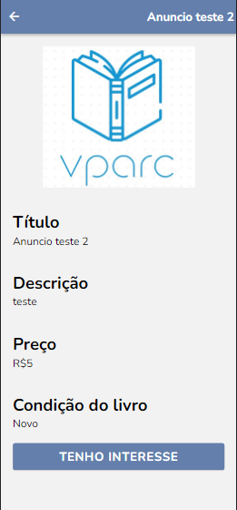

# Veteranos Parceiros - Troca de livros e Informação sobre materiais

1. Gustavo de Olival Albernaz Guerra
1. Bianca Hidemi Kanehira
1. Pedro de Souza Tunin
1. Leonardo Ryo Nakagawa
1. Paulo Henrique Moura Rocha

<!-- * https://docs.google.com/document/d/11UHQol3MJSEbS0Vub-CUUXjuey0ZXbORbg9KH3h0AKE/edit -->

## Apresentação

O projeto consiste em elaborar um sistema, em que tenta aproximar dois tipos de pessoas:

- A que possui qualquer tipo de livro parado em casa e tem vontade de vender ou doá-lo, com o enfoque de livros universitários;
- A que tem a intenção de adquirir um livro/material mas não quer gastar muito ou não pode comprar, sendo aquele estudante buscando formas de estudar e se dedicar a matéria;
- Uma biblioteca de livros, com avaliações de alunos que o utilizaram no passsado, bem como uma função de filtrar os livros pelas matérias que são utilizados.

## Elaboração

- O grupo utilizará de metodologias ágeis ao decorrer do projeto, como Kanban para organização e destinação das tarefas;
- Tecnologias que serão utilizadas:
  - Back-end: Node.JS;
  - Front-end: React Native;
  - Banco de dados: MongoDB.
- Plataforma em que a solução é acessível:
  - Mobile.

## Configuração do Projeto

### Front-end

Pré-requisitos:

- Instalado na máquina o NodeJS (estamos utilizando versão 16.14)

Para realizar a instalação e configuração inicial do projeto, deve-se em primeira instância executar o git clone do projeto e seguir o passo a passo:

- Instalar o expo-cli:

        npm install -g expo-cli

- Dentro da pasta do projeto mobile (VParcMobile), instalar as dependências do projeto:

        npm install

- Em seguida executar o projeto:

        npm start

Após a aplicação ter iniciado, irão aparecer diversas opções do expo no terminal, sendo possível executar o aplicativo em:

- Web;
- Emulador de android;
- Celular esteja conectado ao computador;
- Utilizando o aplicativo ExpoGo (baixado via PlayStore ou AppStore), sincronizando o QR code gerado e mostrado no terminal.

### Back-end

Pré-requisitos:

- Instalado na máquina o NodeJS (estamos utilizando versão 16.14)

Passo a passo:

- Dentro da pasta da api, instalar as dependências do projeto:

        npm install

- Criar um arquivo _.env_ com a mesma estrutura do _.env.example_, mudando apenas os valores das variáveis de ambiente.

- Em seguida executar o projeto:

        npm start

### Utilização

Para realizar os testes na plataform, basta entrar no: https://es-ufabc.github.io/VParc/

## Imagens

### LandPage

### Página de cadastro

Página de cadastro de novo usuário, sendo possível cadastrar com um e-mail de aluno da UFABC.

### HomePage

Página após logar, com opções de verificar os produtos que estão à venda ou para doação

### Página de perfil

Página que contém informações do usuário, bem como as notificações de outros usuários interessados nos produtos e a lista de produtos que ele está ofertando.

### Página de anúncio

Página de um anúncio criado por outro usuário, contendo imagem, e descrição do produto, além disso, o botão de "Tenho interesse" para criar uma nova notificação ao dono do anúncio

### Página de criação de anúncio

Página de criação de anúncio, podendo escolher se é a venda, ou se é doação

